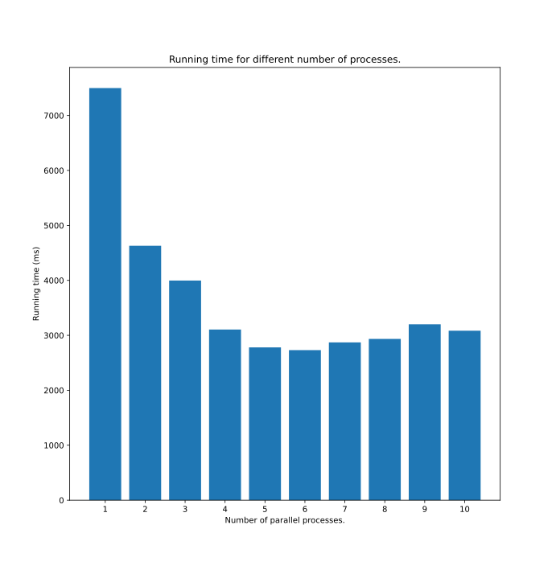

# Перетворення зображень

Перетворення зображень у паралельному режимі:

- Скачати дасет з зображеннями
- Процес рангу 0 відкриває список файлів, надсилає іншим на роботу за допомогою функції scatter
- процеси-виконавці змінюють розмір зображень до 64х64 пікселів, зберігають у файли
- зробити графік часу виконання програми на 1, 2, ... 10 процесах

## Результати

| Кількість процесів | 1    | 2    | 3    | 4    | 5    | 6    | 7    | 8    | 9    | 10   |
| ------------------ | ---- | ---- | ---- | ---- | ---- | ---- | ---- | ---- | ---- | ---- |
| Час роботи (ms)    | 7500 | 4630 | 3997 | 3105 | 2781 | 2731 | 2871 | 2935 | 3201 | 3084 |

